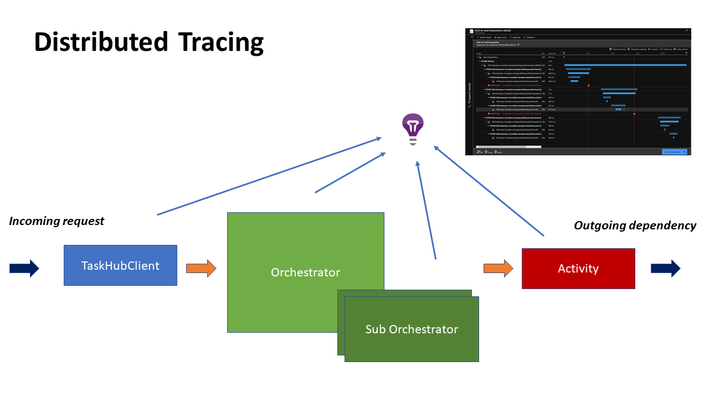

# Correlation Samples

This sample demonstrates legacy distributed tracing using the `CorrelationSettings` API with the Azure Storage provider.

> [!NOTE]
> For comprehensive distributed tracing documentation, including the modern `ActivitySource`-based approach, see the [Distributed Tracing Guide](../../docs/telemetry/distributed-tracing.md).

## Overview

This sample shows the legacy correlation approach using:

- `CorrelationSettings.Current.EnableDistributedTracing` — Enable tracing
- `CorrelationTraceClient.SetUp()` — Manual telemetry callbacks
- Application Insights for trace visualization

## Supported Scenarios

The samples demonstrate tracing across various orchestration patterns:

- Simple orchestrations (`HelloOrchestrator`)
- Fan-out/fan-in (`FanOutFanInOrchestrator`)
- Sub-orchestrations (`SubOrchestratorOrchestration`)
- Retry scenarios (`RetryOrchestration`, `MultiLayeredOrchestrationWithRetry`)
- Continue-as-new (`ContinueAsNewOrchestration`)
- Terminated orchestrations (`TerminatedOrchestration`)

## Getting Started

See [docs/getting-started.md](docs/getting-started.md) for setup instructions.

## Provider Implementation

If you're implementing distributed tracing for a custom provider, see [docs/overview.md](docs/overview.md) for the architecture and extension points.

## Modern Alternative

For new projects, consider using the modern `ActivitySource`-based approach with OpenTelemetry:

- [OpenTelemetry Sample](../DistributedTraceSample/OpenTelemetry)
- [Application Insights Sample](../DistributedTraceSample/ApplicationInsights)
