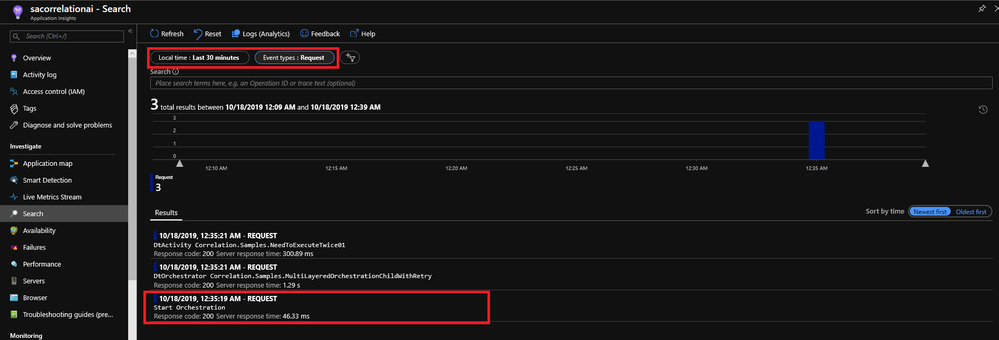
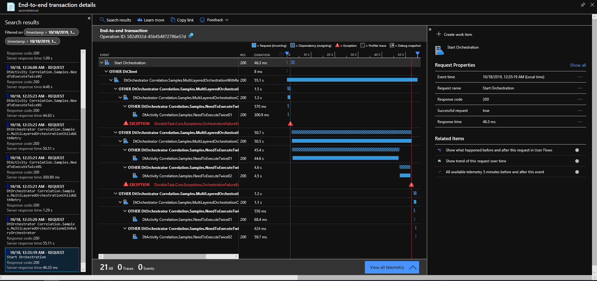

# Getting Started

In this tutorial, you can configure and execute a distributed tracing sample app with several scenarios.

## Prerequisite

The sample application requires these tools. If you don't have it, please click the following link and install it or create it on your Azure subscription.

- [Visual Studio 2019+](https://visualstudio.microsoft.com/vs/)
- [Storage Emulator 5.9+](https://docs.microsoft.com/en-us/azure/storage/common/storage-use-emulator)
- [Application Insights](https://docs.microsoft.com/en-us/azure/azure-monitor/app/create-new-resource)
- [Azure Subscription](https://azure.microsoft.com/en-us/)

## Configration

### Get Application Insights InstrumentKey

Go to Azure Portal. Go to the Application Insights resource, click `Overview.` Copy the `Instrumentation Key` then set the key to the `APPINSIGHTS_INSTRUMENTATIONKEY.`

### DurableTask Settings

Start the [Storage Emulator](https://docs.microsoft.com/en-us/azure/storage/common/storage-use-emulator) Then Configure the Environment Variable `DurableTaskTestStorageConnectionString` as `UseDevelopmentStorage=true`. 

### Protocol Settings

You can choose a correlation protocol. `W3C` for W3C TraceContext. `HTTP` for HTTP Correlation Protocol. Application Insights support the HTTP Correlation Protocol at first. They are now moving toward W3C TraceContext. You can configure `CorrelationProtocol` Environment Variables for the execution sample. 

| Key | Value |
| ---- | ---------|
| APPINSIGHTS_INSTRUMENTATIONKEY | Your Application Insights InstrumentKey |
| DurableTaskTestStorageConnectionString | UseDevelopmentStorage=true |
| CorrelationProtocol | HTTP or W3C |

### Choose Sample Scenario

Go to [Program.cs](../Program.cs) You will find a lot of comments for scenario. Enable one then execute `Correlation.Samples` Project. The Scenario starts orchestration and finishes in several minutes. The sample scenario is listed below. For more detail, Find the `<Senario>.cs` file. It includes code for the orchestration.

| Scenario | Description |
| -------- | ----------- |
| HelloOrchestrator | A simple orchestration. One Orchestrator with One Activity |
| SubOrchestratorOrchestration | An Orchestrator has a sub orchestrator with an Activity |
| RetryOrchestration | Retry Activity execution |
| MultiLayeredOrchestrationWithRetryOrchestrator | Multilayer sub orchestration scenario with retry with sub orchestrator |
| FanOutFanInOrchestrator | Fan-out, Fan-in scenario |
| ContinueAsNewOrchestration | Continue as new scenario |
| TerminatedOrchestration | Terminated scenario | 

**NOTE:** Termination scenario will fail to correlation. 

### Run scenario

Run the `Correlation.Samples` project. It executes orchestration. Then you can see the `Orchestration is successfully finished.` message on the console. Then You can stop the application. Wait around 5 minutes. 

### See EndToEnd Tracing

Go to your Azure Portal, then go to your Application Insights resource. 
Click `Search` on your left list. Filter it with `Last 30 minutes` and `Event types: Request.` You can see the `Start Orchestration` request. Click it.

Then You can see end-to-end tracing. Click and see how it correlates with each other. 

**NOTE:** When you see the correlation breaks, you might wait for a while. The request telemetry of the first orchestrator comes last.  

