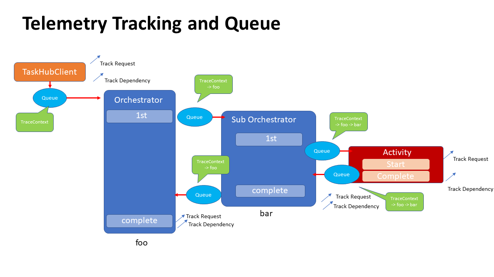
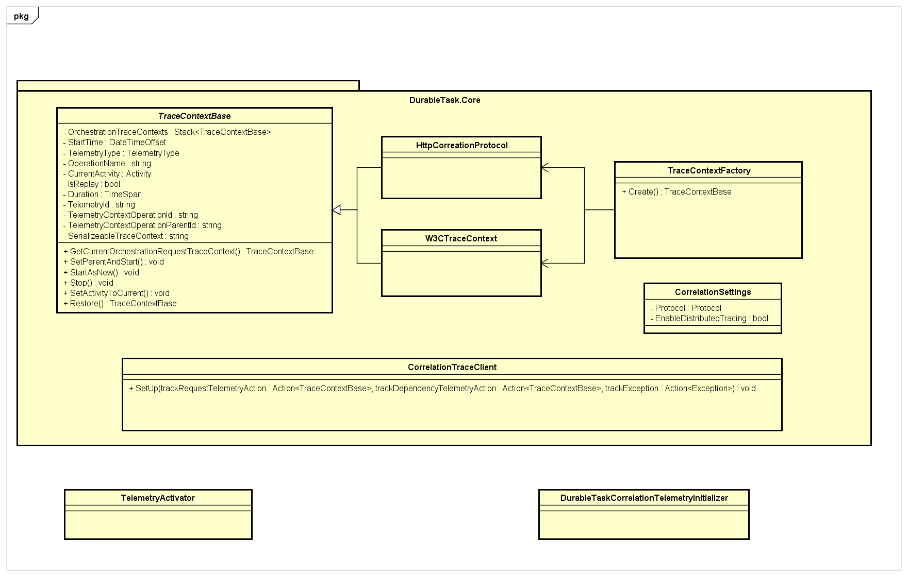

# Develop Distributed Tracing

**Distributed Tracing for DurableTask** provides libraries for developers to implement Distributed Tracing for DurableTask providers. Currently, we implement `DurableTask.AzureStorage`. This document helps to understand the implementation and how to implement Distributed Tracing for other providers. 

This document explains:

* [Prerequisite](#Prerequisite)
* [Architecture](#Architecture)
* [Class library](#Class-library)
* [Configuration](#Configuration)
* [Client implementation](#Client-implementation)
* [Extension points](#Extension-points)
* [Scenario testing](#Scenario-testing)
* [Sample](#Sample)

## Prerequisite

If you are new to the Distributed Tracing with Application insights, you can refer:

- [Correlation with Activity with Application Insights (1 - 3)](https://medium.com/@tsuyoshiushio/correlation-with-activity-with-application-insights-1-overview-753a48a645fb)

It also includes useful links. We assume you have enough knowledge of `DurableTask` repo.

## Architecture

`TaskHubClient` receives [Activity](https://github.com/dotnet/corefx/blob/master/src/System.Diagnostics.DiagnosticSource/src/ActivityUserGuide.md) then tracks the request, then sends `TraceContext` to the queue. The queue has serialized `TraceContext` correlation object. Then track the dependency. The orchestrator `foo` starts. The orchestrator creates a new `TraceContext` that has a parent trace context in the queue. Then the program pushes the trace context to the stack of TraceContext. The sub orchestration starts. It also creates a new `TraceContext` that has parent trace context on the queue, then pushes the trace context to the stack. Once execution of the Activity has finished, Sub orchestrator pop the `TraceContext` from the stack then track Request/Dependency telemetry. Same as the parent orchestrator. 
The stack represents the current TraceContext of the orchestrator. 



## Class library



### [TraceContextBase](../../src/DurableTask.Core/TraceContextBase.cs)

A wrapper of [Activity](https://github.com/dotnet/corefx/blob/master/src/System.Diagnostics.DiagnosticSource/src/ActivityUserGuide.md) class. The Activity class is in charge of handling the correlation information of Application Insights. Activity is designed for in-memory execution. However, Orchestrator requires a replay. The execution is not in-memory. This class wraps the Activity to adopt orchestration execution. This class has a Stack called `OrchestrationTraceContexts.` It is a stack of request/dependency telemetry of orchestrator. 

This class is serialized to queues. However, the default NewtonJSON serializer can't support it. So we have a custom serializer on the `TraceContextBase` class. 

### [CorrelationTraceClient](../../src/DurableTask.Core/CorrelationTraceClient.cs)

Client for Tracking Telemetry. The responsibility is to delegate sending Telemetry to Application Insights to `TelemetryActivator.` (See the detail later). The namespace is DurableTask.Core package. It doesn't have a dependency on the Application Insights library. It only depends on the `System.Diagnostic.Activity`.

### [CorrelationTraceContext](../../src/DurableTask.Core/CorrelationTraceContext.cs)

Share the TraceContext on the AsyncLocal scope. It helps to pass the TraceContext to the other classes without passing as a parameter. It works both on .netcore and .netframework. 

### [CorrelationSettings](../../src/DurableTask.Core/Setting/CorrelationSettings.cs)

Configuration class for Distributed Tracing for DurableTask

### [TelemetryActivator](../TelemetryActivator.cs)

TelemetryActivator has a responsibility to track telemetry. Work with CorrelationTraceClient with giving Lambda to activate Application Insights. This class is a client-side implementation. So this class is **NOT** included in DrableTask namespaces.

### [DurableTaskCorrelationTelemetryInitializer](../DurableTaskCorrelationTelemetryInitializer.cs)

This telemetry Initializer tracks Dependency Telemetry automatically. This initializer support TraceContextBase. This class is **NOT** included in DurableTask namespaces. 

## Configuration

You can configure this feature with the `CorrelationSettings` class. 

| Property | Description | example | default |
| -------- | ----------- | ------- | ------- |
| EnableDistributedTracing | Set true if you need this feature | true or false | false |
| Protocol | Correlation Protocol | W3CTraceContext or HttpCorrelation Protocol | W3CTraceContext |

By default, `EnableDistributedTracing=false` which means this feature is suppressed. No additional code is executed; also, no propagation happens in queues. 

## Client implementation

If you want to use this feature with your client (for example, Durable Functions), you need to develop `TelemetryActivator` and `DurableTaskDependencyTelemetryInitializer.` However, this feature already includes the sample implementation that you can use. 

## Extension points

A provider needs to add Correlation code if you want to have this feature. `DurableTask.AzureStorage` Already has an implementation. I'll share the extension points of `DurableTask.AzureStorage` implementation. All implementation is executed as a lambda expression. The Lambda is never executed if you set EnableDistributedTracing as false. You can search for this method to find the additional extension point. 

```csharp
CorrelationTraceClient.Propagate(
 () => { data.SerializableTraceContext = GetSerializableTraceContext(taskMessage); });
```

### [AzureStorageOrchestrationService](../../src/DurableTask.AzureStorage/AzureStorageOrchestrationService.cs) ([IOrchestrationService](../../src/DurableTask.Core/IOrchestrationService.cs)) class

#### LockNextTaskOrchestrationWorkItemAsync
Receive a work item for orchestration and process it. 

Correlation responsibilities:

- Create Request TraceContext (First time)
- Add the Request TraceContext to the Stack
- Restore Current Orchestration Request TraceContext(Replay)
- Add the Request TraceContext to a WorkItem.


#### CompleteTaskOrchestrationWorkItemAsync
Receive a work item after the `LockNextTaskOrchestrationWorkItemAsync`, Correlation Library is doing:

- Crete Dependency TraceContext from a Work Item
- Add the Dependency TraceContext to the Stack
- Set CorrelationTraceContext.Current = Dependency TraceContext
- Track Request/Dependency Telemetry when the orchestration is finished.
- Pop Request/Dependency Telemetry once Tracked

Why do we need to set the Dependency TraceContext to Collection TraceContext.Current?  `TaskHubQueue` get the TraceContext and send it with a queue message. 

#### LockNextTaskActivitiyWorkItemAsync
Receive a work item for Activity.

The correlation responsibility:

- Create Request TraceContext

#### CompleteTaskActivityWorkItemAsync
Receive a work item after `LockNextTaskActivityWorkItemAsync`. 

The correlation responsibilities:

- Send Request Telemetry to Application Insights
- Set Request TraceContext to `CorrelationTraceContext.Current` to pass the telemetry to the `TaskHubQueue.`


### [TaskHubQueue](../../src/DurableTask.AzureStorage/Messaging/TaskHubQueue.cs) class

#### AddMessageAsync
Inject TraceContext to the queue message.

- Get TraceContext from `CorrelationTraceContext.Current`
- If `CorrelationTraceConext.GenerateDependencyTracking` is true, Generate a Dependency TraceContext and push it tht the Stack.
- Add TraceContext to the queue message.

### [TaskHubClient](../../src/DurableTask.Core/TaskHubClient.cs) class

#### InternalCreateOrchestrationInstanceWithRaisedEventAsync
Method for starting orchestration.

The correlation responsibilities:

- Create Request from Activity. Current as a parent
- Generate Activity with Request TraceContext if it Activity. Current is not exist
- Create Dependency Telemetry for staring orchestration
- Track Request/Dependency telemetry
- Set the Dependency Telemetry to the `CorrelationTraceContext.Current` to pass the telemetry to `TaskHubQueue.`

### [TaskActivityDispatcher](../../src/DurableTask.Core/TaskActivityDispatcher.cs) class

#### OnProcessWorkItemAsync (2 points)
- Set Activity.Current. From the Activity, users can get the correlation info through Activity. Current
- Track Exception Telemetry


### [TaskOrchestrationDispatcher](../../src/DurableTask.Core/TaskOrchestrationDispatcher.cs) class

#### OnProcessWorkItemAsync 
- Set `CorrelationTraceContext.Current`. 

It enable us to get TraceContext from `CorrelationTraceContext.Current` on it's call graph. 

## Scenario testing
Find automated scenario testing and testing framework. Read the [CorrelationScenarioTest.cs](../../Test/DurableTask.AzureStorage.Tests/Correlation/CorrelationScenarioTest.cs). 

The following code is an example of the testing framework. It tests both protocols. Then starts `TestCorrelationOrchestrationHost` with `ExecuteOrchestrationAsync` method. The parameter is the type of target orchestrator class, parameter, and timeout). The method starts the orchestrator, then track the telemetry, then sort it according to the parent/child relationship. 
Then assert if the telemetry order is correct or not. If you have a scenario of tracking exception, you can use the `ExecuteOrchestrationWithException` method instead. 

```csharp
[DataTestMethod]
[DataRow(Protocol.HttpCorrelationProtocol)]
[DataRow(Protocol.W3CTraceContext)]
public async Task SingleOrchestratorWithSingleActivityAsync(Protocol protocol)
{
 CorrelationSettings.Current.Protocol = protocol;
 CorrelationSettings.Current.EnableDistributedTracing = true;
 var host = new TestCorrelationOrchestrationHost();
 List<OperationTelemetry> actual = await host.ExecuteOrchestrationAsync(typeof(SayHelloOrchestrator), "world", 360);
 Assert.AreEqual(5, actual.Count);

 CollectionAssert.AreEqual(
 new (Type, string)[]
 {
 (typeof(RequestTelemetry), TraceConstants.Client),
 (typeof(DependencyTelemetry), TraceConstants.Client),
 (typeof(RequestTelemetry), $"{TraceConstants.Orchestrator} SayHelloOrchestrator"),
 (typeof(DependencyTelemetry), $"{TraceConstants.Orchestrator} {typeof(Hello).FullName}"),
 (typeof(RequestTelemetry), $"{TraceConstants.Activity} Hello")
 }, actual.Select(x => (x.GetType(), x.Name)).ToList());
 }
```

## Sample

You can execute the sample. See [Getting Started](getting-started.md). In this sample, you can learn the implementation and configuration of this library and what is the actual End to end tracking looks like on various scenarios using Application Insights. Start reading code from [Program.cs](../Program.cs).

Recommend to read:

- Configuration [Program.cs](../Program.cs), [ScenarioInvoker.cs](../ScenarioInvoker.cs)
- Implementation of [TelemetryActivator.cs](../TelemetryActivator.cs)
- Implementation of [DurableTaskCorrelationTelemetryInitializer.cs](../DurableTaskCorrelationTelemetryInitializer.cs)
