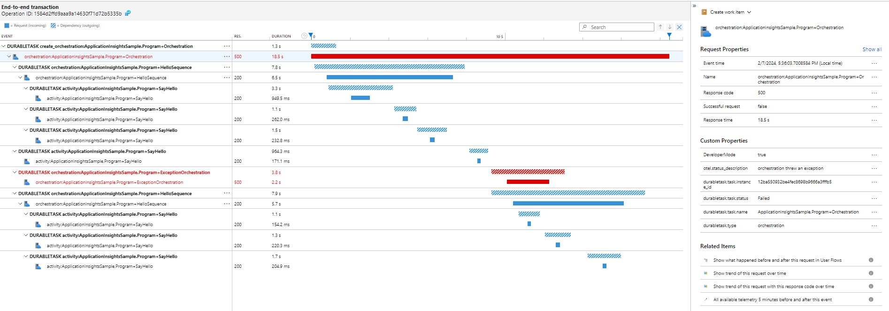
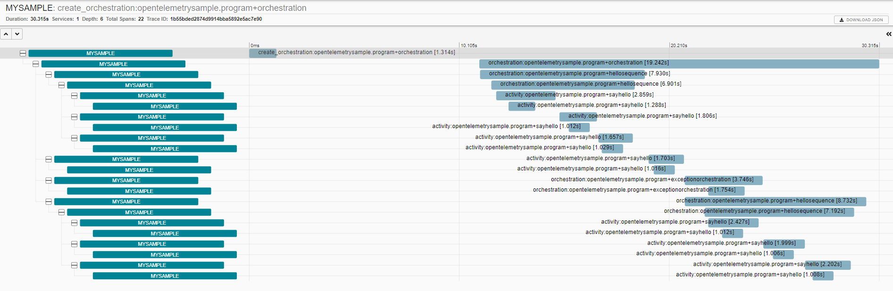

# Distributed Tracing with OpenTelemetry for Durable Task

Enabling distributed tracing in Durable Task allows you to take a closer look at orchestrations and activities and investigate issues quicker.

[OpenTelemetry](https://opentelemetry.io/) provides a way to collect and export telemetry to an observability tool. It is becoming the new standard for distributed tracing and is vendor neutral. Some examples of telemetry exporters that you could choose include Application Insights, Zipkin, Jaeger, and New Relic.

This sample explains how the OpenTelemetrySample project is configured with distributed tracing and emits trace information to the following telemetry exporters: Console, Application Insights, and Zipkin. The following steps can be used to configure your own app as well.

## Prerequisites
If you would like to emit traces to [Application Insights](https://learn.microsoft.com/en-us/azure/azure-monitor/app/app-insights-overview?tabs=net), then create an Application Insights resource in the Azure Portal. If you would like to emit traces to Zipkin, then follow the instructions [here](https://zipkin.io/pages/quickstart.html) to start a local instance.

## Telemetry Exporter Packages

The following package references are added to OpenTelemetrySample.csproj so that the app can emit traces to the console, Application Insights, and Zipkin. You can also configure other telemetry exporters by adding those packages.

```
<ItemGroup>
    <PackageReference Include="OpenTelemetry.Exporter.Console" Version=""1.1.0 />
    <PackageReference Include="Azure.Monitor.OpenTelemetry.Exporter" Version="1.0.0-beta.3" />
    <PackageReference Include="OpenTelemetry.Exporter.Zipkin" Version="1.1.0" />
</ItemGroup>
```

## Tracer Provider

The following startup code is added to create a tracer provider. This code is necessary to add at startup to ensure that the traces are collected and emitted to the correct telemetry exporters. It specifies the service name for the app, which source that the traces should be collected from, and the telemetry exporters where the traces get emitted. "DurableTask.Core" is the service name that will emit the Durable Task related traces.

```
using var tracerProvider = Sdk.CreateTracerProviderBuilder()
    .SetResourceBuilder(ResourceBuilder.CreateDefault().AddService("MySample"))
    .AddSource("DurableTask.Core")
    .AddConsoleExporter()
    .AddZipkinExporter()
    .AddAzureMonitorTraceExporter(options =>
    {
        options.ConnectionString = Environment.GetEnvironmentVariable("AZURE_MONITOR_CONNECTION_STRING");
    })
    .Build();
```

For **Application Insights**, add an app setting with the name `AZURE_MONITOR_CONNECTION_STRING`. If you are running this locally, then add it as an environment variable. If you are running this in Azure, then add it under the **Configuration** page in the portal. The value should be the Application Insights resource connection string.

## Run the application

Run the sample app to execute the orchestrations and emit the traces.

## Looking through the traces

### Console Exporter
Traces emitted to the console should appear in the Visual Studio Debug Console. This telemetry exporter is usually used for testing purposes.


### Application Insights
To view traces in Application Insights, navigate to your Application Insights resource, go to **Transaction Search**, and click on an entry. Then, a Gantt chart should appear showing a visual of the trace and the spans.



### Zipkin
Navigate to your Zipkin instance, and choose a trace to see the Gantt chart.


