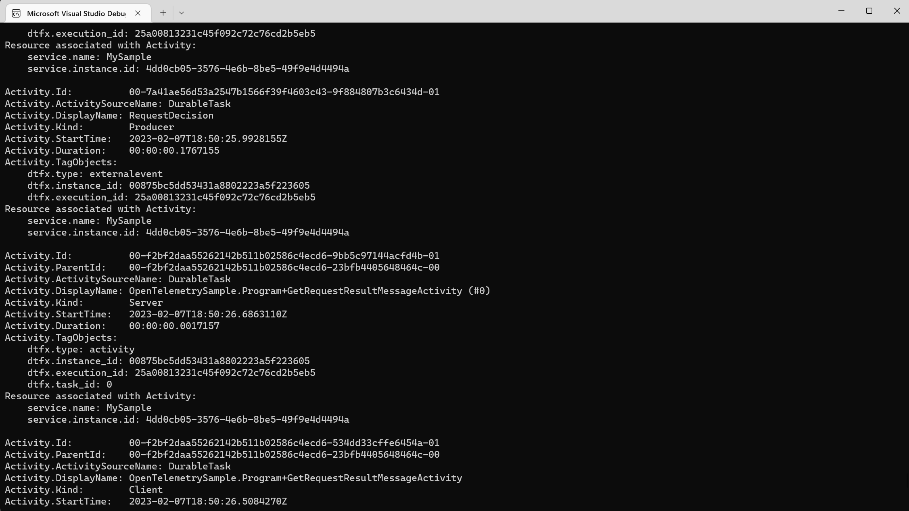
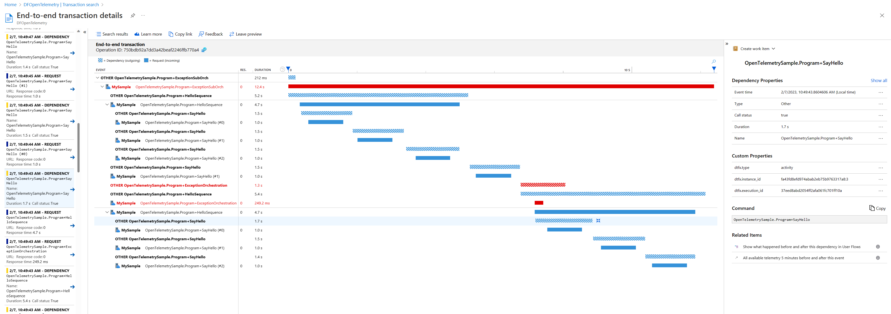
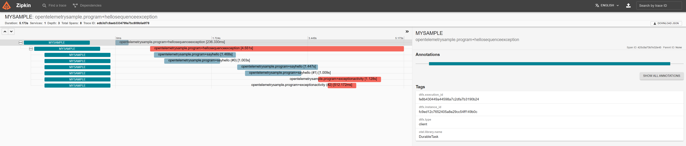

# Distributed Tracing with Open Telemetry for Durable Task

This sample explains how the OpenTelemetrySample project is configured with Distributed Tracing and emits trace information to the following telemetry exporters: Console, Application Insights, and ZipKin. The following steps can be used to configure your own app as well.

## Prerequisites
If you would like to emit traces to Application Insights then create an Application Insights resource in the Azure Portal. If you would like to emit traces to Zipkin, then follow the instructions (here)[https://zipkin.io/pages/quickstart.html] to start a local instance. 

## Telemetry Exporter Packages

The following packages are added to OpenTelemetrySample.csproj so the app can emit traces to the console, App Insights, and Zipkin. You can also configure other telemetry exporters by adding those packages.

```
<ItemGroup>
    <PackageReference Include="OpenTelemetry.Exporter.Console" Version=""1.1.0 />
    <PackageReference Include="OpenTelemetry.Exporter.Zipkin" Version="1.1.0" />
    <PackageReference Include="Azure.Monitor.OpenTelemetry.Exporter" Version="1.0.0-beta.3" />
</ItemGroup>
```

## Tracer Provider

The following startup code is added to create a tracer provider. This code is necessary to add at startup to ensure that the traces are collected and emitted to the correct telemetry exporters. It specifies the service name for the app, which source that the traces should be collected from, and the telemetry exporters where the traces get emitted. "DurableTask" is the service name that will emit the Durable Task related traces.

```
using var tracerProvider = Sdk.CreateTracerProviderBuilder()
    .SetResourceBuilder(ResourceBuilder.CreateDefault().AddService("MySample"))
    .AddSource("DurableTask")
    .AddConsoleExporter()
    .AddZipkinExporter()
    .AddAzureMonitorTraceExporter(options =>
    {
        options.ConnectionString = Environment.GetEnvironmentVariable("AZURE_MONITOR_CONNECTION_STRING");
    })
    .Build();
```

For Application Insights, an app setting with the name `AZURE_MONITOR_CONNECTION_STRING`. If the you are running this locally, then add an environment variable. If you are running this in Azure, then add an app setting under **Configuration**. The value should be the Application Insights resource connection string.

## Run the application

Run the app to execute the orchestrations and emit the traces.

## Looking through the traces

### Console Exporter
Traces emitted to the console should appear in the Visual Studio Debug Console. This telemetry exporter is usually used for testing purposes.



### Application Insights
To view traces in Application Insights, navigate to your Application Insights resource, go to **Transaction Search**, click on an entry and a Gantt chart should appear showing a visual of the trace and the spans.



### Zipkin
Navigate to your Zipkin instance, and choose a trace to see the Gantt chart.

